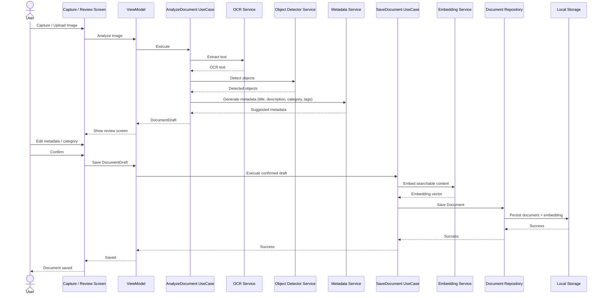
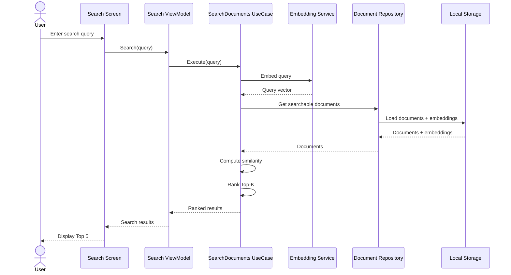

# Application Sequence Diagrams

## Document Capture, Analysis, and Storage

```mermaid
sequenceDiagram
    actor User
    participant Screen as Capture / Review Screen
    participant VM as ViewModel
    participant Analyze as AnalyzeDocument UseCase
    participant OCR as OCR Service
    participant Detector as Object Detector Service
    participant Metadata as Metadata Service
    participant Save as SaveDocument UseCase
    participant Embedder as Embedding Service
    participant Repo as Document Repository
    participant Local as Local Storage

    User->>Screen: Capture / Upload Image
    Screen->>VM: Analyze image
    VM->>Analyze: Execute

    Analyze->>OCR: Extract text
    OCR-->>Analyze: OCR text

    Analyze->>Detector: Detect objects
    Detector-->>Analyze: Detected objects

    Analyze->>Metadata: Generate metadata (title, description, category, tags)
    Metadata-->>Analyze: Suggested metadata

    Analyze-->>VM: DocumentDraft
    VM-->>Screen: Show review screen

    User->>Screen: Edit metadata / category
    User->>Screen: Confirm

    Screen->>VM: Save DocumentDraft
    VM->>Save: Execute confirmed draft

    Save->>Embedder: Embed searchable content
    Embedder-->>Save: Embedding vector

    Save->>Repo: Save Document
    Repo->>Local: Persist document + embedding
    Local-->>Repo: Success

    Repo-->>Save: Success
    Save-->>VM: Success
    VM-->>Screen: Saved
    Screen-->>User: Document saved
```

## Semantic Document Search

```mermaid
sequenceDiagram
    actor User
    participant Screen as Search Screen
    participant VM as Search ViewModel
    participant Search as SearchDocuments UseCase
    participant Embedder as Embedding Service
    participant Repo as Document Repository
    participant Local as Local Storage

    User->>Screen: Enter search query
    Screen->>VM: Search(query)

    VM->>Search: Execute(query)

    Search->>Embedder: Embed query
    Embedder-->>Search: Query vector

    Search->>Repo: Get searchable documents
    Repo->>Local: Load documents + embeddings
    Local-->>Repo: Documents + embeddings
    Repo-->>Search: Documents

    Search->>Search: Compute similarity
    Search->>Search: Rank Top-K

    Search-->>VM: Ranked results
    VM-->>Screen: Search results
    Screen-->>User: Display Top 5
```
